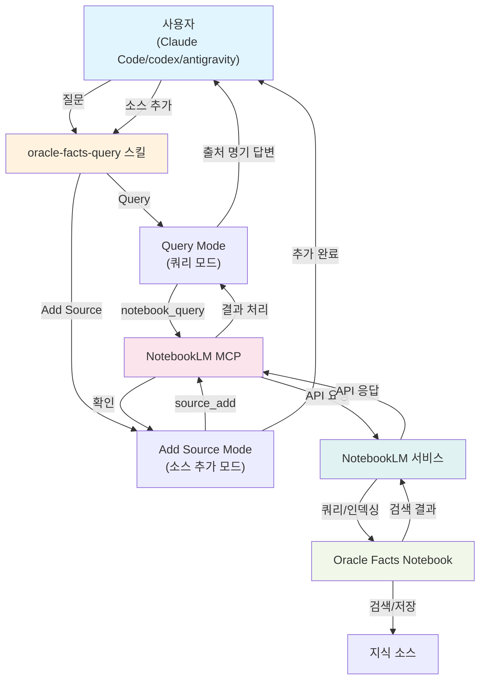

# Oracle Facts 쿼리 및 소스 관리자

Oracle 최신 정보를 소스 인용과 함께 쿼리하고 새로운 소스를 추가하여 지식 베이스를 풍부하게 만드는 Claude Code 스킬입니다.

## 기능

### 📖 쿼리 모드
Oracle Facts 노트북을 검색하고 인용과 함께 답변을 받으세요.

**지원되는 쿼리 유형:**
- 제품 기능 및 역량
- 가격 비교
- 전략 및 공지사항
- 기술 명세
- 경쟁력 분석

### ➕ 소스 추가 모드
지식 베이스를 최신으로 유지하기 위해 새로운 소스를 기여하세요.

**지원되는 소스 유형:**
- 🌐 **웹 URL** - 블로그 글, 기사, 뉴스
- 📄 **문서** - PDF, 텍스트 파일, 오디오
- 📊 **Google Drive** - 문서, 스프레드시트, 슬라이드, PDF
- 📝 **직접 텍스트** - 텍스트 직접 입력

## 설치

### 필수 요구사항
- Claude Code와 스킬 지원
- NotebookLM MCP 설치 및 구성
- NotebookLM 인증 (`nlm login`)

### 빠른 설정

1. **NotebookLM MCP 설치** (아직 설치하지 않은 경우)
   ```bash
   pip install notebooklm-mcp
   ```

2. **NotebookLM 인증**
   ```bash
   nlm login
   ```
   이 명령어는 자격증명을 `~/.notebooklm-mcp-cli/`에 저장합니다.

3. **이 스킬 설치**
   - 이 저장소를 클론하거나 스킬 파일 다운로드
   - Claude Code 스킬 폴더에 복사

4. **완료!** 스킬이 Claude Code 스킬 목록에 나타납니다.

## 사용 방법

### 쿼리 예제

**Oracle 제품에 대해 물어보기:**
```
"Oracle 26ai의 AI Vector Search 기능에 대해 알려줘"
"23ai와 26ai의 차이점이 뭐야?"
"OCI가 AWS보다 얼마나 저렴한가?"
```

### 소스 추가 예제

**웹 URL 추가:**
```
"이 링크를 Oracle facts 노트북에 추가해줘: https://example.com/oracle-news"
```

**문서 업로드:**
```
[PDF 파일 업로드]
"이 PDF를 Oracle facts 노트북에 추가해줘"
```

## 논리 아키텍처

다음 다이어그램은 oracle-facts-query 스킬이 여러 시스템과 어떻게 연계되는지 보여줍니다:



### 아키텍처 구성 요소

| 계층 | 역할 | 구성요소 |
|------|------|---------|
| **사용자 계층** | 스킬 호출 | Claude Code, codex, antigravity |
| **스킬 계층** | 요청 처리 | oracle-facts-query (Query/Add Source 모드) |
| **통합 계층** | API 중개 | NotebookLM MCP |
| **서비스 계층** | 핵심 기능 | NotebookLM 서비스 |
| **데이터 계층** | 정보 저장 | Oracle Facts Notebook + 80+ 소스 |

### 데이터 흐름

**쿼리 흐름:**
```
사용자 질문 
  → 스킬이 Query Mode 실행
  → NotebookLM MCP를 통해 notebook_query 호출
  → NotebookLM이 Notebook 검색
  → 결과를 [1] [2] [3] 형식으로 출처 명기하여 반환
```

**소스 추가 흐름:**
```
사용자 소스 제공 (웹/PDF/Google Drive/텍스트)
  → 스킬이 Add Source Mode 실행
  → NotebookLM MCP를 통해 source_add 호출
  → NotebookLM이 Notebook에 소스 저장 및 인덱싱
  → 추가 완료 확인 반환
```

- AI Vector Search
- Agentic AI
- Autonomous Database

**OCI 및 인프라 (IaaS/PaaS)**
- OKE (Kubernetes) 스토리지 연동 (Block, File, Object Storage)
- OCI vs AWS 가격 및 성능 비교
- Exadata 및 ODA (Oracle Database Appliance) 관리

#### ③ 딥 리서치 (Deep Research) 모드 선택

**왜 Deep Research를 선택해야 하나?**

- 단순 검색 (Fast Research)은 기본적인 정보만 수집합니다
- OGG의 구체적인 파라미터 튜닝, ZDM의 단계별 아키텍처 같은 **심층 기술 내용**을 가져올 수 없습니다
- **Deep Research는 시간이 몇 분 더 소요되지만**, oracle.com 도메인 전체를 깊이 있게 탐색하여 다음과 같은 전문 자료를 수집합니다:
  - PDF 백서
  - 릴리스 노트
  - 기술 상세 가이드
  - 아키텍처 문서

---

## 3. 소스 추가 방법

위의 기준에 맞는 소스를 실제로 노트북에 추가하는 방법입니다.

### A. 프롬프트를 통한 검색 및 추가 (Deep Research 활용)

NotebookLM의 채팅창에 리서치 명령어를 입력하여 AI가 직접 문서를 찾아오게 합니다.

**명령어 예시:**

```
"Oracle GoldenGate 26ai Hub MSA 구조에서의 Remote Capture/Apply 성능 튜닝에 
대한 Oracle 공식 가이드를 딥 리서치(Deep Research) 모드로 검색해서 소스에 추가해줘."
```

```
"Azure에서 OCI로 Oracle DB 및 K8s를 마이그레이션하는 Zero Downtime Migration(ZDM) 
및 OKE 관련 아키텍처 문서를 딥 리서치해 줘."
```

```
"Oracle 26ai의 AI Vector Search, Agentic AI 기능 및 실제 구현 사례에 대한 
Oracle 공식 자료를 딥 리서치 모드로 수집해줘."
```

**진행 과정:**
1. 명령어를 입력하면 NotebookLM이 Deep Research를 시작합니다 (약 5분 소요)
2. 검색이 완료되면 좌측 소스 패널에 대기 중인 결과가 나타납니다
3. 각 결과를 검토하고 '**가져오기 (Import)**' 하여 소스로 확정합니다

### B. 웹사이트 링크 직접 추가 (Website)

Google 검색이나 Oracle 기술 블로그를 통해 직접 찾은 URL이 있다면:

1. 소스 패널의 **+ 추가** 버튼을 클릭합니다
2. **웹사이트 (Website)** 옵션을 선택합니다
3. 찾은 URL을 붙여넣습니다

**좋은 출처 찾는 팁:**
- `site:oracle.com` 검색어를 Google에서 사용
- Oracle Architecture Center에서 직접 브라우징
- Oracle Blog에서 최신 게시물 확인

### C. 로컬 문서 및 백서 업로드 (PDF / Text)

Oracle Help Center 등에서 다운로드한 기술 문서가 있다면:

1. 소스 패널의 **+ 추가** 버튼을 클릭합니다
2. **파일 (File)** 옵션을 선택합니다
3. 로컬 PC의 PDF 파일을 업로드합니다

**자주 업로드되는 문서 유형:**
- Database Upgrade Guide
- Zero Downtime Migration Guide
- GoldenGate Performance Tuning Guide
- OCI Architecture 백서
- Exadata 관리 가이드

### D. Google Drive 문서 추가 (Google Drive)

공유된 Google 문서나 스프레드시트가 있다면:

1. 소스 패널의 **+ 추가** 버튼을 클릭합니다
2. **Google Drive** 옵션을 선택합니다
3. 공유하려는 Google 문서를 선택합니다

---

## 추천 소스 추가 워크플로우

효율적으로 노트북을 구축하려면 다음 순서로 진행하세요:

### 1단계: Deep Research로 기초 자료 수집
```
"Oracle 26ai 핵심 기능, AI Vector Search, Agentic AI에 대한 
모든 Oracle 공식 문서를 딥 리서치 모드로 수집해줘."
```

### 2단계: 특정 주제별 심화 리서치
```
"Oracle GoldenGate 26ai의 성능 최적화, 파라미터 튜닝, 모니터링에 대한 
기술 가이드를 딥 리서치해줘."
```

### 3단계: 마이그레이션 관련 문서
```
"Zero Downtime Migration, OCI로의 클라우드 마이그레이션, Kubernetes 
이관 가이드를 딥 리서치 모드로 찾아줘."
```

### 4단계: 수동으로 특정 블로그/문서 추가
- 검색 중 발견한 좋은 출처는 웹사이트 링크로 직접 추가
- PDF 백서를 받았다면 파일 업로드

### 5단계: 정기적인 업데이트
- 새로운 Oracle 공지사항 확인
- 최신 기술 블로그 글 추가
- 릴리스 노트 업데이트

---

## 효과적인 노트북 운영 팁

### ✅ 해야 할 것
- **정기적 업데이트**: 매월 새로운 소스 확인 및 추가
- **명확한 구조**: 노트북 이름과 설명으로 용도 명확히 함
- **깊이 있는 검색**: Deep Research로 기술적 정확성 확보
- **소스 다양화**: URL, PDF, Google Drive 등 여러 형식 활용

### ❌ 피해야 할 것
- 신뢰도가 낮은 제3자 블로그 무분별하게 추가
- Fast Research만 사용 (심층 기술 정보 누락)
- 중복되는 소스 너무 많이 추가 (노트북 무거워짐)
- 오래된 문서만 보유 (최신 버전 무시)

---

## 노트북 운영 체크리스트

노트북을 구축할 때 다음을 확인하세요:

- ✅ 노트북 이름이 명확하고 용도를 반영하는가?
- ✅ Oracle 공식 문서가 주요 소스인가?
- ✅ Deep Research를 활용하여 심층 자료를 수집했는가?
- ✅ 최신 정보 (2024-2026년 문서)를 포함하는가?
- ✅ 기술 주제별로 다양한 소스를 확보했는가?
- ✅ 각 소스가 정확한지 검토했는가?

---

## 라이선스

MIT 라이선스 - LICENSE 파일 참조

## 지원

문제가 있거나 질문이 있으면 이슈를 생성하거나 풀 리퀘스트를 제출해주세요.

---

**Claude Code 커뮤니티를 위해 ❤️ 로 만들었습니다**

질문이 있으신가요? 이슈를 생성하거나 개선 사항을 기여해주세요!
